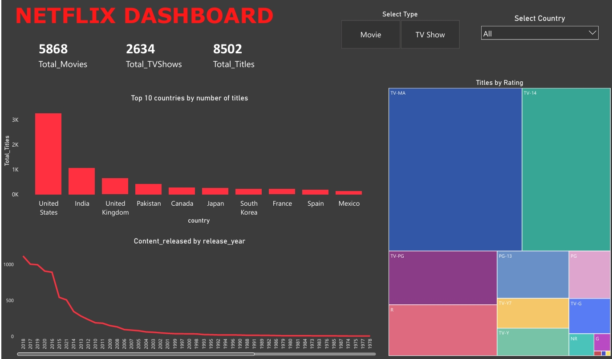

# Netflix SQL & Power BI Project

## Project Description

This project utilizes a CSV dataset from [Kaggle](https://www.kaggle.com/datasets/shivamb/netflix-shows), which is imported into SQL for data cleaning and analysis.  
SQL is used to clean the dataset and extract analytical insights.  
Power BI is then leveraged to create visualizations from the processed data.

---

## Project Demo

